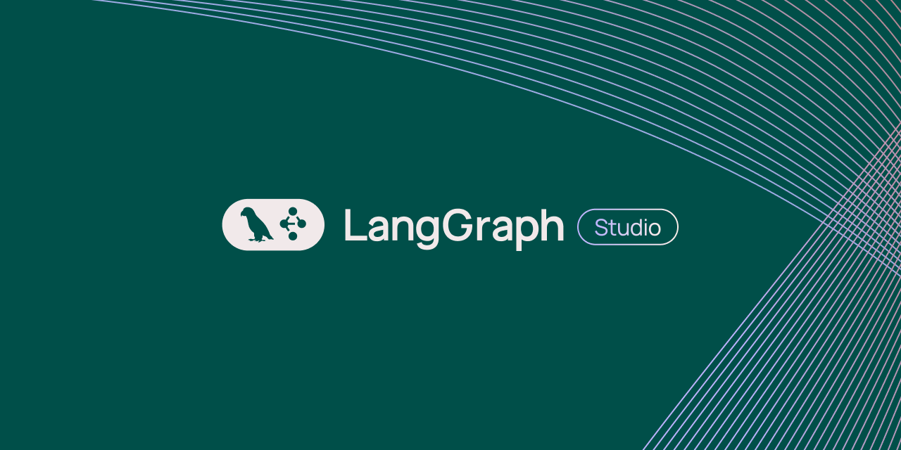

<h1 align="center">
    
</h1>

<h3 align="center">A passionate software Engineer from Palestine 🇵🇸</h3>

---

## 🚀 About Me

🔭 I’m currently working on **some awesome projects**  
🌱 I’m  learning **Advanced Backend, IoT**  
💬 Ask me about **Node.js, React, MongoDB... or anything [here](https://github.com/Jad-Atout/Jad-Atout/issues)**  
⚡ Fun fact: **Bees can recognize human faces**

---

## 📫 Connect With Me

 
  
  

---

## ⚒️ Languages & Tools

  
   
  

---

## 🐍 My GitHub Contributions

  

---

## 📊 GitHub Stats

  
  
    
  

---

## 🏆 LeetCode Status

  

